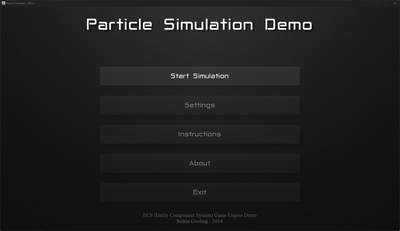
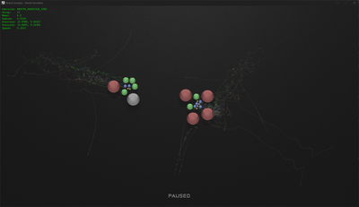
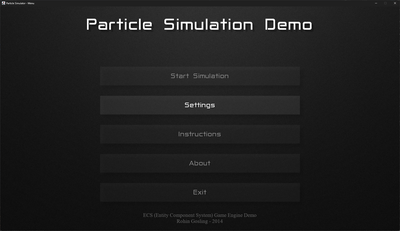
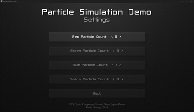

# ECS Game Engine (Java Version)

<p align="center">
  &emsp;
  
</p>

An ECS (Entity Component System) game engine framework in Java.

The repo includes two example applicaitons showing how to use the engine.
1. A simple "Hello World" application demonstrating setup of a basic component, entity, and system, to write "Hello World!" to the terminal.
2. A particle physics demo that uses all features of the engine.

## 📑 Table of Contents

- [📖 About](#-about)
- [⚛️ Particle Simulator Demo](#-particle-simulator-demo)
- [🚀 Quickstart](#-quickstart)
- [🎮 Controls](#-controls)
- [📁 Project Structure](#-project-structure)
- [🔗 Module Dependencies](#-module-dependencies)
- [📋 Requirements](#-requirements)
- [▶️ Running from the IDE](#-running-from-the-ide)
- [📦 Building a Standalone Executable](#-building-a-standalone-executable)
- [⚙️ Configuration](#-configuration)
- [🏛️ Architecture Overview](#-architecture-overview)
- [📄 License](#-license)

## 📖 About

This project was developed in as an academic exercise in ECS (Entity Component System) game engine architecture. The engine implements the core features of a typical general purpose ECS game engine.

This Java version is a port of an earlier C++ version I wrote in 2004. The academic exercise in 2014 required a Java program. So I decided to save some time and port the core features of my original C++ version to Java.  

### Core ECS Elements

- **Entities** 
  - Containers that represent objects in a game world.  
  - e.g. Players, NPCs, weapons, bullets, menus, backgrounds, etc). 
  - Entities are effectively nothing more than an ID.


- **Components**
  - Pure data containers attached to entities.
  - e.g. Hit-points, position, geometry, state, etc.


- **Systems**
  - Stateless processors that operate on entities and their components each frame.
  - Systems handle things like rendering, AI, physics, collisions, force accumulation, etc, whatever else your game needs to do.


- **ECS Game Engine**  
  - During initialization, components are registered with systems registered to process them.
    - e.g. A physics component storing gravitational data would be registered with a gravity computation system.
    - e.g. A game world geometry component would be registered with a world-to-screen projection system or a rendering system.
  - Each frame of a game, all systems are executed in the order they are added to a game engine.
    - Each system iterates over all entities in the game.
    - For each entity, the system iterates over all components attached to the entity, looking components registered with the system.
    - The data held by components registered with the system is accumulated and processed by the system.

### Levels and Layers

- Levels, UI screens, and layers are implemented by extending the core ECS game engine.
- An application class is then used to orchestrate the ECS game engine instances and maintain high level application state.

### Utility and Support Libraries

A number of generic utility and support libraries are included with the engine to handle peripheral functionality around the core ECS engine.

- **CommandManager**
  - Command queue to control entities, components, and systems. All external or internal impulses are triggered by commands.
  - e.g. Player keystroke -> Movement command -> Entity position.
  - e.g. AI movement impulse -> Movement command -> Entity position.


- **EventManager**
  - Event queue and event listener, that allows entities and systems to raise events, or listen for events they are registered to listen for.


- **GlobalCache**
    - Simple key-value data store for sharing data across ECS engine instances.
    - e.g. Particle counts configured in the menu screen, made available to the simulation screen.


- **ResourceManager**
  - Asset registry for loading, caching, and retrieving game resources.
  - e.g. Sprite images, background images, sound effects, data files, etc.


- **AWTJavaPlatform**
  - AWT/Swing rendering and input abstraction layer.
  - Provides windowing, double-buffered drawing, and a keyboard event handler template for subclassing.


- **UtilityClassLibrary**
  - Shared utility classes used across the engine and applications.
  - Includes Vector2D, math utilities, application settings loader, console logger, string table localization, and text formatting.


## ⚛️ Particle Simulator Demo

The included demo implements a particle physics simulation that demonstrates all features of the ECA game engine.

The particle simulation itself simulates particles interacting under configurable physics:

- **Gravity** - Newtonian gravitational attraction between all particle pairs.
- **Repulsion** - Short-range repulsive force using a smooth polynomial kernel.
- **Collision** - Billiard-ball elastic collision with iterative resolution.
- **Friction** - Global and anisotropic friction coefficients.
- **Trails** - Per-particle motion trails with configurable depth and opacity.
- **User control** -- Select individual particles and accelerate them with the keyboard.

Particles are organized into four color-coded groups (red, green, blue, yellow), each with distinct physical properties. Application and simulation properties can be adjusted via `settings.properties`. Particle group sizes may be set in two ways, either in `settings.properties` or via the settings menu in the application.

## 🚀 Quickstart

1. Go to the Releases page on the GitHub repository. 
2. Under the latest release, download the `.zip` file (e.g., **Particle.Simulator.v1.0.zip**)
3. Extract the zip to a folder of your choice.
4. Open the extracted folder and double-click `particle-simulator.exe`.

|                                                                                                                                                                                                                                                                                                                                                    |                                                                             |
|:---------------------------------------------------------------------------------------------------------------------------------------------------------------------------------------------------------------------------------------------------------------------------------------------------------------------------------------------------|:----------------------------------------------------------------------------------|
| ▪ From the main menu, select `Settings`.                                                                                                                                                                                                                                                                                                         |         |
| ▪ Use the `left` and `right` arrow keys to increment or decrement particle counts per group.                                                                                                                                                                                                                                                       |  |
| ▪ Use the `Tab` key to cycle through selected particles. `Shift`+`Tab` to cycle back.<br/>▪ Use the `arrow keys` to accelerate the selected particle.<br/>▪ If a particle is selected, press the `Esc` key to deselect the particle.<br/>▪ Press the `Esc` key when no partilces are selected to exit the simulation and return to the main menu. |        |

## 🎮 Controls

### Menu

| Key | Action |
|-----|--------|
| Up / Down Arrow | Cycle through menu buttons |
| Left / Right Arrow | Adjust particle count on settings screen |
| Enter | Activate the selected button |
| Esc | Go back one menu level |

### Simulation

| Key | Action |
|-----|--------|
| Arrow Keys | Accelerate the selected particle |
| Tab | Select the next particle |
| Shift + Tab | Select the previous particle |
| P | Pause / unpause |
| T | Toggle particle trails |
| W | Toggle wireframe overlay |
| Esc | Deselect all particles, or exit to menu |

## 📁 Project Structure

```
v2/
├── build.sh                          Build script (jpackage)
├── Library/
│   ├── ECSGameEngine/                ECS core (engine, entity, component, system)
│   ├── CommandManager/               Command queue pattern for input decoupling
│   ├── ResourceManager/              Asset registry with load/unload lifecycle
│   ├── AWTJavaPlatform/              Swing/AWT windowing and double-buffered rendering
│   ├── UtilityClassLibrary/          Vector2D, GMath, ApplicationSettings, logging
│   ├── EventManager/                 Event publish/subscribe system
│   └── GlobalCache/                  Cross-screen key-value data store
│
└── Demo/
    ├── HelloWorld/                   Minimal engine demo
    └── ParticleDemo/                 Particle simulator (main demo)
        ├── settings.properties       All configurable values
        ├── src/                      Application, engines, systems, components, etc.
        ├── test/                     JUnit 5 unit tests (569 tests)
        └── Resources/               Images, fonts, sounds, text
```

## 🔗 Module Dependencies

```
ParticleDemo → ECSGameEngine → CommandManager → UtilityClassLibrary
                             → ResourceManager
                             → UtilityClassLibrary
             → AWTJavaPlatform → UtilityClassLibrary
             → GlobalCache
```

## 📋 Requirements

- **JDK 14+** (developed with OpenJDK 25)
- **IntelliJ IDEA** for IDE-driven development
- **JUnit 5** for tests (jars included in `lib/junit5/`)

## ▶️ Running from the IDE

Open the project in IntelliJ IDEA and import the modules under `Library/` and `Demo/` (each module has a `src` folder, and most also have a `test` folder). Add the JUnit 5 jars from `lib/junit5/` as a library for the test modules, then run `Demo/ParticleDemo/src/rohin/gameengine/application/Main.java` with the working directory set to the project root. For a command-line workflow, use `build.sh` (package) and `run-tests.sh` (tests). The module dependency graph is shown above under **Module Dependencies**.

## 📦 Building a Standalone Executable

The build script uses `jpackage` to create a self-contained Windows application with a bundled JRE. No Java installation is required on the target machine.

```bash
./build.sh                # Portable app directory
./build.sh --installer    # Windows installer (.exe) — requires WiX 3+
```

Output is placed in `build/particle-simulator/`. The launcher is `particle-simulator.exe`.

## ⚙️ Configuration

All simulation parameters are configurable in `Demo/ParticleDemo/settings.properties`, including:

- Physics constants (gravity, repulsion, friction, elasticity)
- Particle group properties (mass, radius, count)
- Visual settings (trails, shadows, sprites, HUD)
- Menu layout and fonts
- Initial particle velocities

## 🏛️ Architecture Overview

### ECS Game Loop

```
while running:
    commandManager.flush()          // execute queued commands
    for each system: system.update(t)  // run all systems
    regulateFrameRate()             // target 90 FPS
```

### Particle Simulation System Pipeline

| Order | System | Role |
|-------|--------|------|
| 1 | ParticleGroupPropagator | Copy group properties to individual particles |
| 2 | Gravity | Newtonian gravitational attraction (F = Gm1m2/r^2) |
| 3 | Repulsion | Short-range repulsive force (smooth polynomial kernel) |
| 4 | ForceAccumulator | Resolve user input forces, apply F=ma, clear accumulators |
| 5 | Physics | Integrate velocity, apply friction |
| 6 | Collider | Boundary and particle-particle elastic collision |
| 7 | Renderer | Draw background, trails, shadows, sprites, wireframe, HUD |

### Input Handling

All user input flows through `CommandManager`. Keyboard events post `ICommand` objects that encapsulate their effect on game state. This decouples input source from game logic. The same commands could be issued by an AI agent.

### Math

For the sake of interest, here's all the math I used in the particle demo.

#### Gravity

Gravitational attraction between two particles using Newtonian mechanics, with a softening parameter $\epsilon$ to prevent singularities at close range.

$$\vec{d} = \vec{p}_2 - \vec{p}_1$$

$$F = \frac{G \, m_1 \, m_2}{\|\vec{d}\|^2 + \epsilon^2}$$

$$\hat{n} = \frac{\vec{d}}{\|\vec{d}\|}$$

$$\vec{F}_1 = F \, \hat{n}, \quad \vec{F}_2 = -F \, \hat{n}$$

Where:
- $G$ is the gravitational constant
- $m_1, m_2$ are the particle masses
- $\epsilon$ is the softening parameter
- $\hat{n}$ is the unit direction vector from particle 1 to particle 2

#### Repulsion

Short-range repulsive force using a smooth quadratic kernel. Active only when particles are within a threshold distance but not overlapping. *Kind of* simulates the strong nuclear force.

$$d_{\min} = r_1 + r_2$$

$$d_{\text{threshold}} = 2 \, d_{\min}$$

$$s = \frac{\|\vec{d}\| - d_{\min}}{d_{\text{threshold}} - d_{\min}}, \quad s \in [0, 1]$$

$$F = R \, (1 - s)^2$$

$$\vec{F}_1 = F \, \hat{n}, \quad \vec{F}_2 = -F \, \hat{n}$$

Where:
- $R$ is the repulsive constant
- $s$ is the normalized gap ($0$ at contact, $1$ at the threshold edge)
- $r_1, r_2$ are the particle radii
- The force is only applied when $d_{\min} < \|\vec{d}\| < d_{\text{threshold}}$

#### Force Accumulation

All forces (gravity, repulsion, user input) are summed into a force accumulator per particle. Newton's second law converts the net force into acceleration, which is then integrated into velocity using explicit Euler integration.

$$\vec{F}_{\text{net}} = \vec{F}_{\text{gravity}} + \vec{F}_{\text{repulsion}} + \vec{F}_{\text{user}}$$

$$\vec{a} = \frac{\vec{F}_{\text{net}}}{m}$$

$$\vec{v}' = \vec{v} + \vec{a} \, \Delta t$$

The force accumulator is reset to $\vec{0}$ after each frame.

#### Physics

Position is integrated using explicit Euler integration. Friction is applied as a per-frame damping coefficient.

$$\vec{p}' = \vec{p} + \vec{v} \, \Delta t$$

$$\vec{v}' = \vec{v} \cdot k_f$$

Where:
- $\Delta t$ is the frame time in seconds
- $k_f$ is the friction coefficient (e.g., $0.995$), applied per frame

For user-controlled particles, anisotropic friction is applied — the friction coefficient differs per axis depending on whether the user is providing input on that axis:

$$v'_x = v_x \cdot \begin{cases} k_f & \text{if user input on } x \\ k_a & \text{otherwise} \end{cases}$$

$$v'_y = v_y \cdot \begin{cases} k_f & \text{if user input on } y \\ k_a & \text{otherwise} \end{cases}$$

Where $k_a$ is the anisotropic friction coefficient (stronger damping on the uncontrolled axis).

#### Elastic Collision Physics (Billiard Ball Physics)

**Wall collisions** clamp the particle position to the boundary and reflect the velocity, scaled by an elasticity coefficient $e$:

$$v'_n = -|v_n| \cdot e$$

$$p' = \text{clamp}(p, \; r, \; w - r)$$

Where $v_n$ is the velocity component normal to the wall, and $w$ is the world boundary.

**Particle-particle collisions** use impulse-based resolution. Overlapping particles are first separated proportionally to their masses, then an impulse is applied along the collision normal.

*Overlap separation:*

$$\delta = d_{\min} - \|\vec{d}\|$$

$$\vec{p}'_1 = \vec{p}_1 - \hat{n} \cdot \delta \cdot \frac{m_2}{m_1 + m_2}$$

$$\vec{p}'_2 = \vec{p}_2 + \hat{n} \cdot \delta \cdot \frac{m_1}{m_1 + m_2}$$

*Impulse (applied only when particles are approaching, i.e., $v_{\text{rel}} < 0$):*

$$v_{\text{rel}} = (\vec{v}_2 - \vec{v}_1) \cdot \hat{n}$$

$$e = \frac{e_1 + e_2}{2}$$

$$j = \frac{-(1 + e) \, v_{\text{rel}}}{\dfrac{1}{m_1} + \dfrac{1}{m_2}}$$

$$\vec{v}'_1 = \vec{v}_1 - \frac{j \, \hat{n}}{m_1}$$

$$\vec{v}'_2 = \vec{v}_2 + \frac{j \, \hat{n}}{m_2}$$

Where:
- $j$ is the impulse magnitude
- $e$ is the averaged coefficient of restitution
- $\hat{n}$ is the collision normal (unit vector from particle 1 to particle 2)

#### World-Space to Screen-Space Projection

All particle positions are stored in normalized world coordinates. The projection to screen pixels uses the screen height and a zoom factor.

$$k = h_{\text{screen}} \cdot z$$

$$x_{\text{screen}} = x_{\text{world}} \cdot k - \frac{d}{2}$$

$$y_{\text{screen}} = y_{\text{world}} \cdot k - \frac{d}{2}$$

$$d = 2 \, r \cdot k$$

Where:
- $k$ is the world-to-screen conversion factor
- $h_{\text{screen}}$ is the screen height in pixels
- $z$ is the zoom factor
- $r$ is the particle radius in world units
- $d$ is the particle diameter in screen pixels
- The $\frac{d}{2}$ offset centers the sprite on the particle position

## 📄 License

Released under the [MIT License](LICENSE) — Copyright © 2014 Rohin Gosling.
